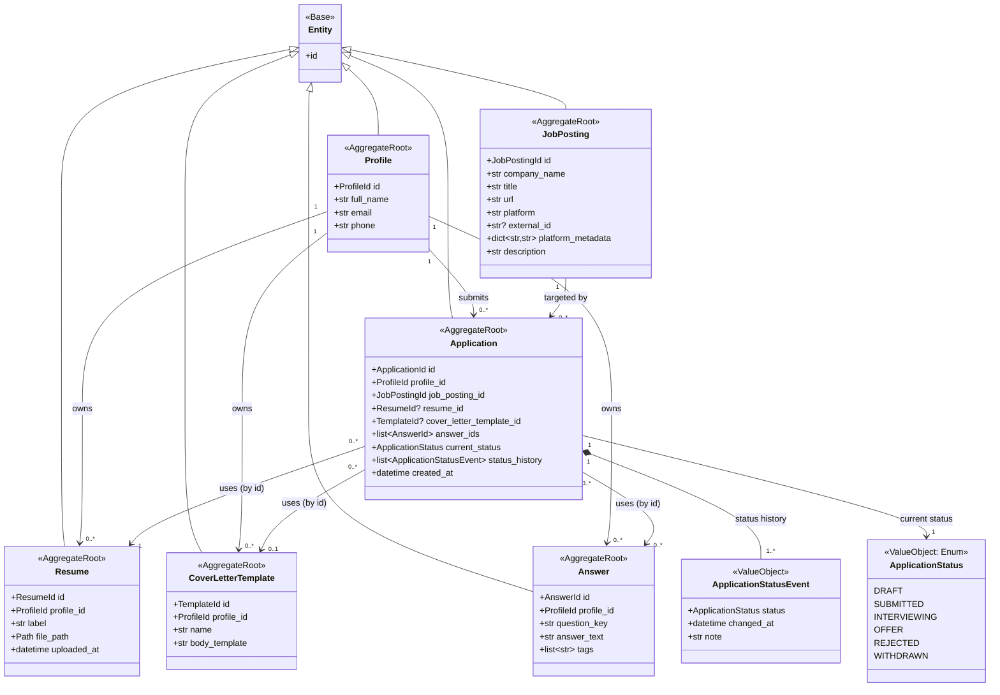

# Domain Model: Aggregates, Relationships, and Repositories

This document precedes Milestone 2 (domain model implementation) and defines
the aggregate boundaries the Pydantic models must respect. See
[ARCHITECTURE.md](../../ARCHITECTURE.md) for how the domain layer fits into
the overall system.

## Aggregate Boundary Reasoning

Each entity below was evaluated against one question: **does it have a
lifecycle and identity worth managing independently?**

- **Profile** — root of "who is applying." Aggregate root.
- **Resume** — independently created, listed, and selected across many
  applications; too substantial to embed inside `Profile`. Aggregate root,
  references `Profile` by ID.
- **CoverLetterTemplate** — same reasoning as Resume. Aggregate root,
  references `Profile` by ID.
- **Answer** — a reusable answer is created once and reused across many
  applications; needs independent search/reuse. Aggregate root, references
  `Profile` by ID.
- **JobPosting** — externally-sourced data (scraped/connector-provided),
  not owned by any Profile. Keeping it un-owned now avoids a restructure
  when multi-user support (Phase 5) arrives. Aggregate root, no owner
  reference.
- **Application** — the central transactional record tying a profile,
  resume, job posting, optional template, and answers together, with its
  own status lifecycle. Aggregate root.
- **ApplicationStatus** / **ApplicationStatusEvent** — value objects with
  no independent identity; persisted as part of the `Application`
  aggregate, never fetched on their own.

**Governing rule:** aggregates reference other aggregates only by ID, never
by embedded object. This is what allows each repository to load, save, and
enforce invariants on only its own aggregate, independent of the rest.

**Entity identity (ADR-0003):** all six aggregate roots inherit from a
shared `Entity` base class rather than `BaseModel` directly. `Entity`
defines equality and hashing based solely on `(type, id)`, not on any other
field — reflecting that two representations of the same entity (e.g. one
freshly loaded, one locally mutated) are the same object regardless of
what their other fields currently hold. `ApplicationStatusEvent` is
intentionally excluded from this — as a value object, its equality
remains structural.

## Diagram

`<|--` = inheritance (all aggregate roots inherit identity semantics from `Entity`).
`-->` = reference-by-ID association across aggregate boundaries.
`*--` = composition, owned with no independent identity.

## Cardinality Summary

| Relationship | Cardinality | Notes |
|---|---|---|
| Profile → Resume | 1 → 0..* | one profile, many resumes |
| Profile → CoverLetterTemplate | 1 → 0..* | one profile, many templates |
| Profile → Answer | 1 → 0..* | one profile, many reusable answers |
| Profile → Application | 1 → 0..* | one profile, many applications over time |
| JobPosting → Application | 1 → 0..* | same posting can have multiple attempts |
| Application → Resume | 0..* → 0..1 | optional until submission; required by `SubmitApplicationUseCase`, not the model |
| Application → CoverLetterTemplate | 0..* → 0..1 | optional; may use an unsaved one-off letter, or none at all |
| Application → Answer | 0..* ↔ 0..* | true many-to-many; empty at Draft; persisted as an ordered association object, not a plain join table, so `answer_ids`' order survives a save/load round trip (see [ADR-0004](../adr/0004-session-loading-ordering-and-restrictive-deletes.md)) |
| Application → ApplicationStatusEvent | 1 → 1..* | append-only history, always ≥1 event (`DRAFT`) |

### Lifecycle-Based Validation

`Application` can exist in a `DRAFT` state with only `profile_id`,
`job_posting_id`, and system metadata (`id`, `created_at`,
`current_status=DRAFT`, an initial `status_history` entry) required.
`resume_id`, `cover_letter_template_id`, and `answer_ids` are populated
progressively as the user works through the application.

This is a deliberate split between two different kinds of rules:

- **Domain invariants** (enforced in the `Application` model itself):
  `status_history` is append-only, `current_status` always equals the
  most recent event, and status transitions are structurally valid
  (e.g., `DRAFT` can't jump straight to `OFFER`). These protect the
  object's own consistency and hold regardless of *why* something is
  happening.
- **Business process rules** (enforced in use cases, e.g.
  `SubmitApplicationUseCase`, Milestone 6): "a resume must be attached
  before submission," "the job posting must still be open," etc. These
  are about *when an action is allowed*, which is contextual and can
  change without the domain model needing to change.

Putting readiness checks in the constructor would make it structurally
impossible to represent a real, valid in-progress draft — the presence
of that state is expected, not an error condition.

### Aggregate Mutation Strategy (ADR-0003)

Two tiers, depending on whether a field carries a cross-field invariant:

- **Single-field validation** (`Resume.file_path`, `Answer.question_key`,
  `JobPosting.platform`, `Profile.email`, etc.): `Profile`, `Resume`,
  `CoverLetterTemplate`, `Answer`, and `JobPosting` all enable
  `validate_assignment=True`, so a later reassignment re-runs the same
  validator that ran at construction — closing the gap where Pydantic
  otherwise validates only once, at creation.
- **Cross-field invariant** (`Application.current_status` must always
  match the most recent `status_history` entry): `validate_assignment`
  can't safely apply here, since keeping both fields consistent requires
  two sequential assignments. Instead, `Application` overrides
  `__setattr__` to reject direct assignment to `current_status` or
  `status_history` from outside the class, raising `DomainError`.
  `transition_to()` remains the only sanctioned way to change status.
  Fields without a cross-field invariant (`resume_id`,
  `cover_letter_template_id`, `answer_ids`) remain freely settable, which
  is what allows the progressive Draft lifecycle described above.

### Open Platform Identifiers & Connector Extension Point (ADR-0003)

`JobPosting.platform` is a plain, normalized, non-empty string rather than
a closed `Enum` — `JobPlatform` remains as a small class of suggested
constants (`GREENHOUSE`, `LEVER`, `WORKDAY`, `LINKEDIN`, `OTHER`) for
convenience, but any connector may supply a new platform string without
modifying this model. `JobPosting` also carries `external_id` (a stable,
connector-supplied dedup/re-fetch key, since `url` alone isn't reliable
across scrapes) and `platform_metadata: dict[str, str]` (an open bag for
any additional connector-specific data). Together, these mean a new
job-site connector — including LinkedIn — is purely additive: it never
requires a change to `JobPosting` or any other existing domain file.

See [ADR-0003](../adr/0003-entity-identity-and-connector-extensibility.md)
for the full reasoning and alternatives considered for all of the above.

## Repositories

One per aggregate root — six total:

- `ProfileRepository`
- `ResumeRepository`
- `CoverLetterTemplateRepository`
- `AnswerRepository`
- `JobPostingRepository`
- `ApplicationRepository`

No repository exists for `ApplicationStatus` or `ApplicationStatusEvent` —
they are value objects persisted as part of `ApplicationRepository`'s
responsibility. Cross-aggregate composition (e.g., assembling a full
"review this application" view) is done by use cases calling multiple
repositories — never by a repository reaching into another aggregate.
