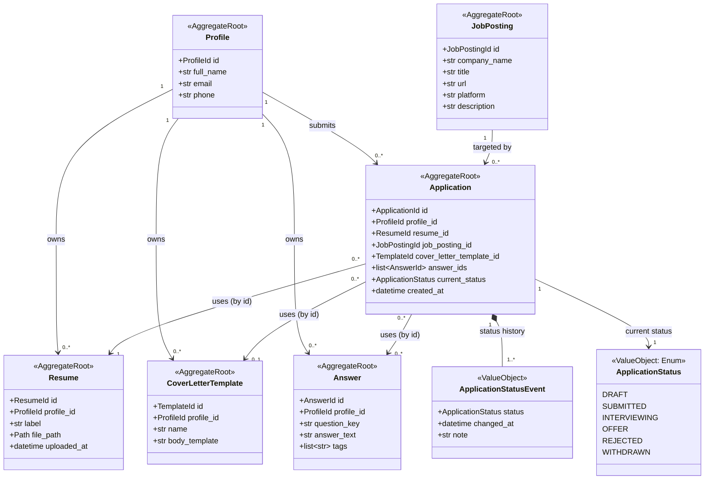

# Domain Model: Aggregates, Relationships, and Repositories

This document precedes Milestone 2 (domain model implementation) and defines
the aggregate boundaries the Pydantic models must respect. See
[ARCHITECTURE.md](../../ARCHITECTURE.md) for how the domain layer fits into
the overall system.

## Aggregate Boundary Reasoning

Each entity below was evaluated against one question: **does it have a
lifecycle and identity worth managing independently?**

- **Profile** — root of "who is applying." Aggregate root.
- **Resume** — independently created, listed, and selected across many
  applications; too substantial to embed inside `Profile`. Aggregate root,
  references `Profile` by ID.
- **CoverLetterTemplate** — same reasoning as Resume. Aggregate root,
  references `Profile` by ID.
- **Answer** — a reusable answer is created once and reused across many
  applications; needs independent search/reuse. Aggregate root, references
  `Profile` by ID.
- **JobPosting** — externally-sourced data (scraped/connector-provided),
  not owned by any Profile. Keeping it un-owned now avoids a restructure
  when multi-user support (Phase 5) arrives. Aggregate root, no owner
  reference.
- **Application** — the central transactional record tying a profile,
  resume, job posting, optional template, and answers together, with its
  own status lifecycle. Aggregate root.
- **ApplicationStatus** / **ApplicationStatusEvent** — value objects with
  no independent identity; persisted as part of the `Application`
  aggregate, never fetched on their own.

**Governing rule:** aggregates reference other aggregates only by ID, never
by embedded object. This is what allows each repository to load, save, and
enforce invariants on only its own aggregate, independent of the rest.

## Diagram

`-->` = reference-by-ID association across aggregate boundaries.
`*--` = composition, owned with no independent identity.

## Cardinality Summary

| Relationship | Cardinality | Notes |
|---|---|---|
| Profile → Resume | 1 → 0..* | one profile, many resumes |
| Profile → CoverLetterTemplate | 1 → 0..* | one profile, many templates |
| Profile → Answer | 1 → 0..* | one profile, many reusable answers |
| Profile → Application | 1 → 0..* | one profile, many applications over time |
| JobPosting → Application | 1 → 0..* | same posting can have multiple attempts |
| Application → Resume | 0..* → 1 | many applications can reuse the same resume |
| Application → CoverLetterTemplate | 0..* → 0..1 | optional; may use an unsaved one-off letter |
| Application → Answer | 0..* ↔ 0..* | true many-to-many; needs a join table once persisted (Milestone 4) |
| Application → ApplicationStatusEvent | 1 → 1..* | append-only history, always ≥1 event (`DRAFT`) |

## Repositories

One per aggregate root — six total:

- `ProfileRepository`
- `ResumeRepository`
- `CoverLetterTemplateRepository`
- `AnswerRepository`
- `JobPostingRepository`
- `ApplicationRepository`

No repository exists for `ApplicationStatus` or `ApplicationStatusEvent` —
they are value objects persisted as part of `ApplicationRepository`'s
responsibility. Cross-aggregate composition (e.g., assembling a full
"review this application" view) is done by use cases calling multiple
repositories — never by a repository reaching into another aggregate.
